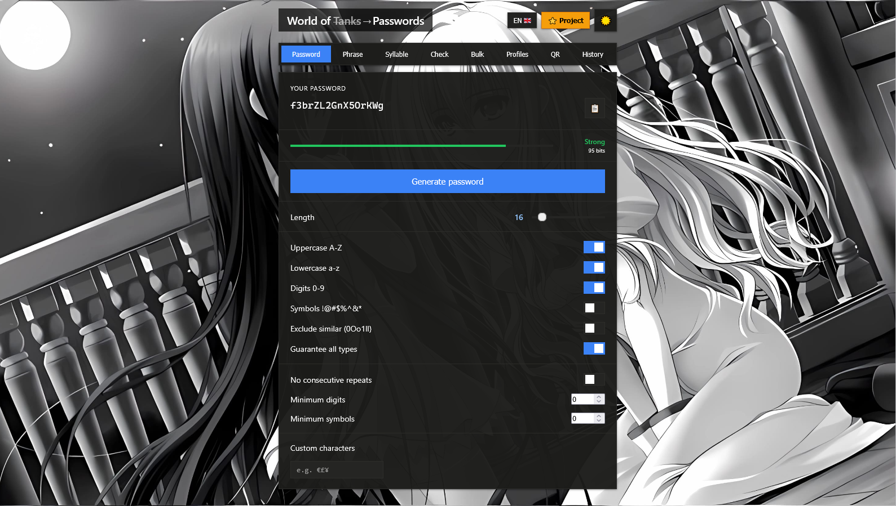

## 🔐 World of Passwords

⭐ Поставь звезду, если проект оказался полезным!

**Локальный генератор паролей с проверкой утечек. Работает полностью в браузере — никакие данные не передаются на сервер.**

🌍 Три языка на выбор: Русский, English, Українська

🌓 Светлая и тёмная темы

📱 Адаптивный дизайн под разные операционные устройства

## ✨ Возможности

## 🎲 Генерация паролей
- **Классический пароль** — длина от 4 до 128 символов, выбор наборов (A-Z, a-z, 0-9, спецсимволы), свои символы
- **Парольная фраза** — из словаря 200+ слов, настраиваемый разделитель, цифры и символы
- **Произносимый пароль** — слоговые паттерны (CV, CVC, VCV), легко запомнить и продиктовать

## 🛡️ Безопасность
- Криптографически стойкая генерация (`crypto.getRandomValues`)
- Оценка стойкости: визуальная шкала и расчёт энтропии в битах
- Оценка времени взлома брутфорсом
- Проверка утечек через **Have I Been Pwned** (k-anonymity — пароль не покидает браузер)

## ⚙️ Тонкая настройка
- Исключение похожих символов (0, O, o, 1, l, I)
- Гарантированное включение всех выбранных типов
- Запрет повторов подряд
- Минимум цифр и спецсимволов
- Свои символы

## 💾 Профили и история
- Сохранение профилей настроек
- Экспорт/импорт профилей (JSON)
- История сессии (последние 15, только в памяти)

## 📋 Инструменты
- **Пакетная генерация** — до 100 паролей, копирование и скачивание .txt
- **QR-код** — визуализация и скачивание PNG
- **Проверка любого пароля** — стойкость и утечки

## 🔒 Приватность

Все вычисления — локально в браузере. При проверке HIBP отправляются только первые 5 символов SHA-1 хеша.

## 🚀 Запуск

Открой в браузере: https://michi-mochirellune.github.io/World-of-Passwords-Secure-Generator-OpenSource/

### 🛠 Технологии

Vanilla JS, Web Crypto API, HIBP API, QR Code Generator, CSS Custom Properties.

## 📄 Лицензия
GNU General Public License v3.0

✅ Можно использовать, изменять, распространять

✅ Можно встраивать в коммерческие проекты

❌ Нельзя закрыть исходный код и продавать как проприетарный продукт

❌ Производные проекты — тоже под GPL
